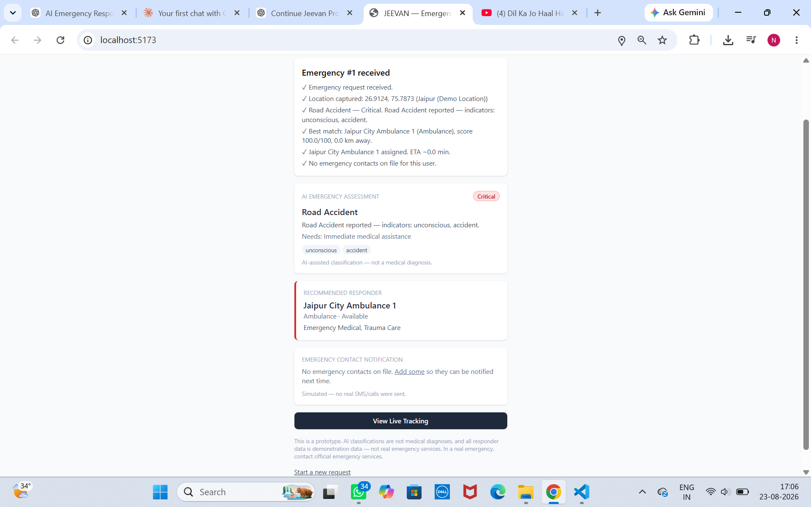
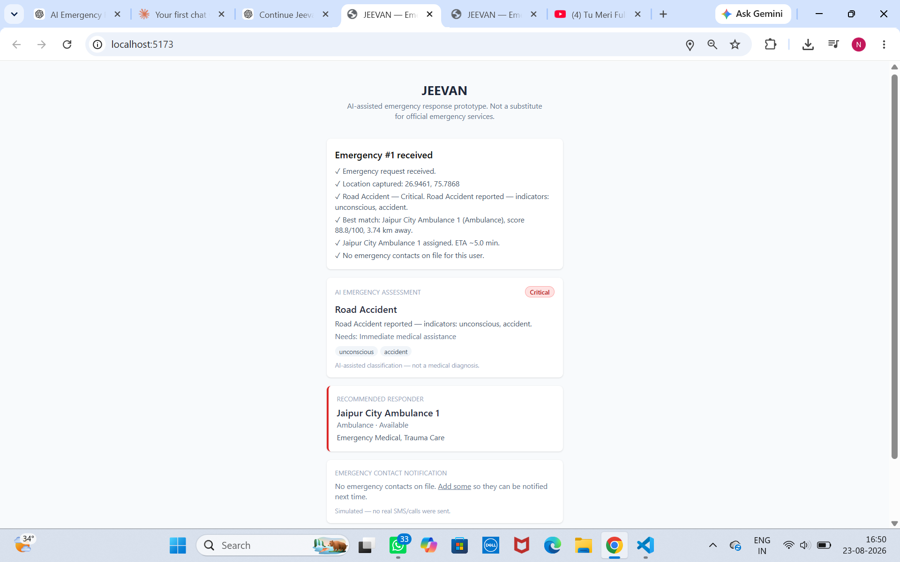
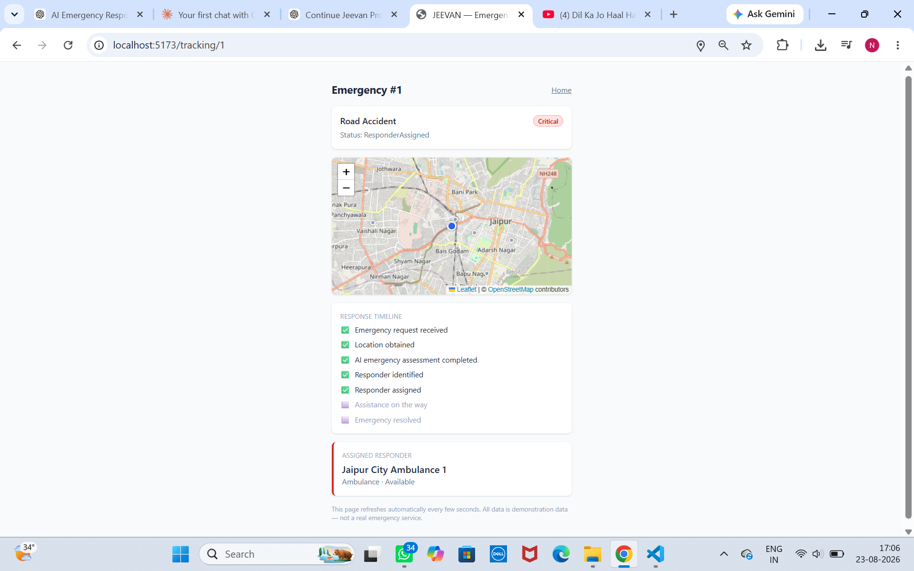

# JEEVAN — AI-Assisted Emergency Response & Responder Coordination System

AI-assisted emergency response and responder coordination prototype built with Python, FastAPI, React, SQLite, and LLM-based emergency classification.

> The project demonstrates REST APIs, geolocation, algorithmic responder matching, database relationships, automated testing, and AI-assisted emergency assessment.

> **This is a prototype, not a real emergency system.** AI classifications
> are not medical diagnoses. Responder data is demonstration data. Estimated
> arrival times are illustrative. Contact appropriate official emergency
> services during a real emergency.

---

## 🎥 Project Demo Video

A short walkthrough demonstrating the complete JEEVAN emergency response workflow — from emergency reporting and AI-based assessment to responder matching and live tracking.

👉 **[Watch the JEEVAN Project Demo](https://drive.google.com/file/d/1wO9gKxfh6027qkOr3qeqgqHcXaVbbBhH/view?usp=sharing)**

## Problem Statement

When someone is alone during a medical or accident emergency — elderly,
injured, or otherwise unable to act quickly — every minute lost between
the incident and getting help to the right place matters. Existing
emergency-calling systems assume the caller can speak clearly on a
phone call, describe their situation accurately, and knows who to call.
That assumption often doesn't hold.

## Motivation

This project is inspired by a real situation in which elderly relatives
living alone were involved in a serious road accident and were unable to
independently contact appropriate emergency assistance. JEEVAN explores
how AI, location services, and responder coordination could reduce that
communication/coordination delay.

## Proposed Solution

A single "Request Emergency Help" action that:
1. Captures the user's location (or falls back to a demo location)
2. Lets the user describe the emergency by voice or text
3. Uses AI to classify the emergency type and severity
4. Scores and ranks nearby demo responders, assigning the best match
5. Simulates notifying the user's emergency contacts
6. Tracks the incident through a live status timeline and map
7. Gives a responder/admin dashboard to manage and resolve incidents

## Features

- One-tap emergency request with GPS capture (with demo-location fallback)
- Voice input via the Web Speech API, with graceful text fallback
- AI-assisted emergency classification (type, severity, summary,
  indicators) with a deterministic offline mock fallback
- Transparent, explainable responder-matching algorithm (0-100 score)
- Haversine-distance-based ETA estimates
- Emergency contact profiles + simulated notification
- Live tracking screen with a Leaflet/OpenStreetMap map
- Responder/admin dashboard to assign responders and update status
- Repeatable one-click Demo Mode for presentations
- 26 automated backend tests

## AI Components

`backend/app/services/ai_classifier.py` sends the user's raw emergency
description to an LLM (Claude, via the Anthropic API) with a strict
system prompt asking for structured JSON: `emergency_type`, `severity`,
`summary`, `assistance_required`, `indicators`. If no API key is
configured, or the call fails for *any* reason, a deterministic
keyword-based classifier takes over instantly — so the system is never
dependent on network access or a paid API key to function or to demo.

This is explicitly **AI-assisted classification, not a medical
diagnosis**, and is labeled as such in the UI.

## System Architecture

```
React + Vite (frontend)  <-- REST/JSON -->  FastAPI (backend)  <-->  SQLite
        |                                          |
   Web Speech API                        Anthropic API (optional)
   (voice-to-text,                       with deterministic mock
    browser-native)                      fallback always available
```

See `docs/ARCHITECTURE.md` for the full diagram and the reasoning behind
each technology choice.

## Technology Stack

| Layer | Technology |
|---|---|
| Frontend | React, Vite, Tailwind CSS, React Router, Axios, Leaflet/react-leaflet |
| Backend | Python, FastAPI, Pydantic |
| Database | SQLite, SQLAlchemy ORM |
| AI | Anthropic API (Claude), with deterministic mock fallback |
| Voice | Web Speech API (browser-native) |
| Maps | Leaflet + OpenStreetMap (free, no API key) |
| Testing | pytest, FastAPI TestClient |

## Database Schema

Five tables: `users`, `emergency_contacts`, `responders`, `emergencies`,
`emergency_events`. Full column list and relationships are in
`docs/ARCHITECTURE.md`. Quick summary:

- A **user** has many **emergency_contacts** and many **emergencies**
- An **emergency** belongs to at most one **user**, is assigned at most
  one **responder**, and has many **emergency_events** (its timeline)

## Installation

**Prerequisites:** Python 3.10+, Node.js 18+

```bash
git clone <this-repo>  # or unzip the provided archive
cd jeevan
```

### Backend
```bash
cd backend
python -m venv venv
source venv/bin/activate        # Windows: venv\Scripts\activate
pip install -r requirements.txt
cp .env.example .env
cd ../database
python init_db.py
python seed_data.py
cd ../backend
uvicorn app.main:app --reload
```
Local API server: http://localhost:8000

Interactive API documentation: http://localhost:8000/docs

These URLs are for local development. The project is currently provided as a runnable prototype and is not deployed to a public server.

### Frontend
```bash
cd frontend
npm install
npm run dev
```
Local application: http://localhost:5173

The frontend runs locally using Vite. A public deployment is not currently provided.

## Environment Variables

`backend/.env` (copy from `.env.example`):

| Variable | Required? | Purpose |
|---|---|---|
| `ANTHROPIC_API_KEY` | No | Enables real AI classification. Leave blank to use the mock classifier — the app works fully either way. |
| `DATABASE_URL` | No | Defaults to `sqlite:///../database/jeevan.db` |
| `DEMO_MODE` | No | Informational flag, defaults to `true` |

## Running Backend

```bash
cd backend
uvicorn app.main:app --reload
```

## Running Frontend

```bash
cd frontend
npm run dev
```

## Demo Mode

On the Home screen, click **"▶ Run Demo Scenario"**. This instantly sets
a demo location (Jaipur) and pre-fills the exact presentation scenario
text, skipping the GPS permission dialog so a live demo never stalls.
Click "Send Emergency Request" to run the full pipeline. Click "Start a
new request" to repeat it as many times as needed.

## 📸 Screenshots

### Emergency Result

The system displays the emergency assessment, severity, assigned responder, and emergency contact notification status.



### AI Assessment & Responder Matching

JEEVAN analyzes the emergency description, determines its severity and type, and recommends the most suitable responder based on the matching algorithm.



### Live Emergency Tracking

The tracking screen provides the emergency location, assigned responder, current status, and response timeline on an interactive map.



## Example Emergency Scenario

**Input** (typed or spoken): *"An elderly person has been hit by a
vehicle. He is unconscious and bleeding."*

**System response:**
- Emergency Type: **Road Accident**
- Severity: **Critical**
- Assistance Required: **Immediate medical assistance**
- Best-matched responder: nearest **Available Ambulance** (highest
  score across distance, availability, capability, and severity fit)
- Emergency contacts (if any saved): notified (simulated)
- Tracking screen: live 7-stage timeline + map
- Dashboard: incident appears, can be advanced through
  EnRoute → Resolved

## Limitations

- Responder data is entirely simulated/demo data, not real services
- No real SMS/WhatsApp/call integration — notification is simulated
- ETA is `distance / responder speed`, not real traffic-aware routing
- No real authentication — the dashboard is open by design, for demo simplicity
- AI classification can be wrong; it is not a medical diagnosis
- Haversine distance is straight-line, not road distance

## Future Enhancements

- Real SMS/WhatsApp notification integration (e.g. Twilio)
- Real routing/ETA via a mapping API
- Authenticated responder accounts and role-based dashboard access
- Live GPS tracking of actual responder movement
- Multi-language voice input and AI classification
- Push notifications instead of polling

## Ethical & Safety Considerations

- This system does not replace, and must never be presented as
  replacing, official emergency services
- AI-assisted classification is explicitly labeled as not a medical
  diagnosis, both in this document and in the UI itself
- All responder contact information and locations are fictional
  demonstration data
- Location data is only used to power the demo and is not shared with
  any third party
- Estimated arrival times are illustrative, not guarantees

## Project Structure

```
jeevan/
├── frontend/        React + Vite + Tailwind app
├── backend/          FastAPI app, services, routers, tests
├── database/         DB init + seed scripts
└── docs/
    ├── API.md         Full endpoint reference
    ├── ARCHITECTURE.md  Diagrams, schema, tech decisions
    └── VIVA_NOTES.md    "What this does" / "How to explain in viva" per module
```

## Running Tests

```bash
cd backend
pytest tests/ -v
```
26 tests covering distance calculation, responder matching, AI
classification (with and without an API key), notification simulation,
status updates, and full end-to-end emergency creation via HTTP.
